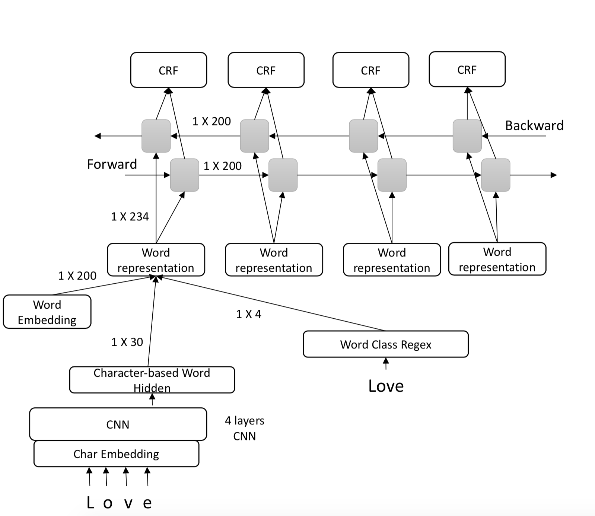

# Social Media Text Name-entity Recognizer

Our task is to build a named-entity recognizer for Twitter text, a key component of our tweet-scanning system.

Our final modle was based on LSTM + CNN ensemble modle:

Detailed methods and error analysis can be found in this essay:
